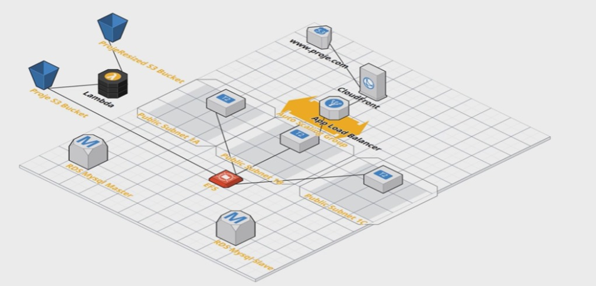
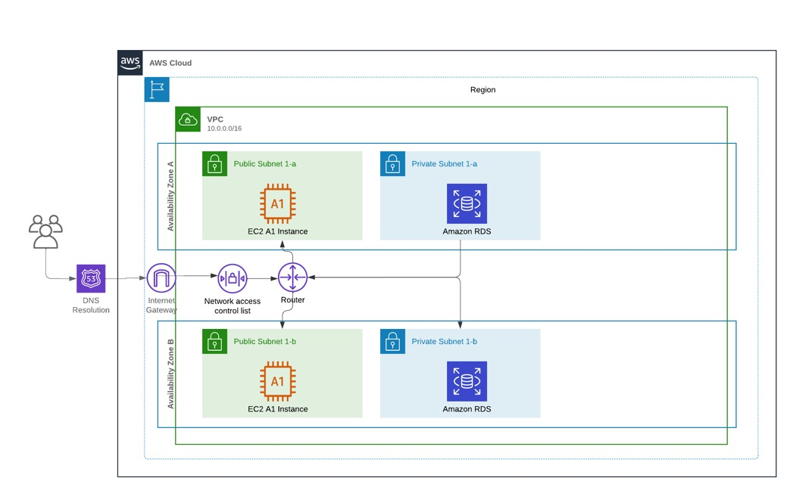

**Project Architecture**

- This application will run on EC2 virtual machines that we will create in the Auto Scaling group. The Auto Scaling group will create at least three virtual machines, at least one on each of our public subnets. If these virtual machines consume more than 90% CPU, it will increase their number to up to five virtual machines. All these virtual machines will be placed behind a Load Balancer that we will create to ensure load distribution. Later, it will be quickly accessible from all over the world with a CloudFront distribution we will create, and this web-based application will be accessed from a URL such as www.proje.com using the Route 53 DNS service.
- Our application will write users' images to the EFS drive shared by EC2 machines; Name, e-mail and phone information will be recorded in the RDS database. Then, users will store the images they uploaded in the S3 bucket and make a backup in another S3 bucket using the Lambda function in the same way.

AWS's infrastructure provides a hierarchical structure for organizing and managing various services and resources. This structure consists of components such as **Region**, **Availability Zone** and **VPC (Virtual Private Cloud)**. Here is the explanation of this hierarchy:

1. **AWS Cloud**

AWS Cloud, Amazon Web Services'in is the cloud computing platform it offers. It allows users to run their applications and infrastructures in the cloud by taking advantage of various services.

2. **Region**

**Region:** AWS offers many clusters of data centers, called geographies, around the world. Each region contains one or more Availability Zones.

**Independent Regions:** Each region is independent from other regions and is designed to provide data transfer, low latency, and high availability. Regions are often located in large geographic areas (e.g., North America, Europe, Asia-Pacific). Example: us-east-1 (Northern Virginia), eu-west-1 (Ireland).

3. **Availability Zone**

**Availability Zone (AZ):** Each region contains one or more AZs with isolated and independent electrical, network, and cooling infrastructure.

**Physical Privilege:** AZ'ler located in physically separate locations but low latency with their duration are connected to each other. This ensures high availability and fault tolerance.

Örnek: us-east-1a, us-east-1b, us-east-1c.

4. **Virtual Private Cloud (VPC)**

**VPC:** It is a virtual private network environment.

**Network Configuration:** You can specify IP address ranges, subnets, routing tables and gateways within the VPC.

**Security:** VPCs, security groups, and network access control lists (ACL's) is secured by.

5. **Subnets**

You can create two types of subnets within VPC: **public subnet** ve **private subnet**.

**Public Subnet:** These are subnets that are accessible over the Internet. **of EC2** web servers, front-end applications and other components are public subnet is placed.

**Private Subnet:** These are subnets that do not have internet access and only communicate with other resources within the VPC. **Amazon RDS** private for privacy and security subnet takes place. **of EC2** a backend transaction server or data analytics server is located here.
